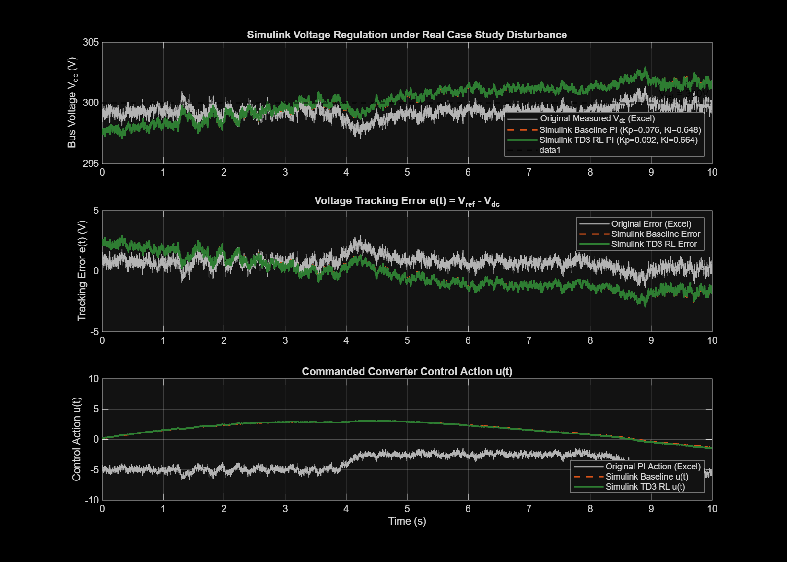
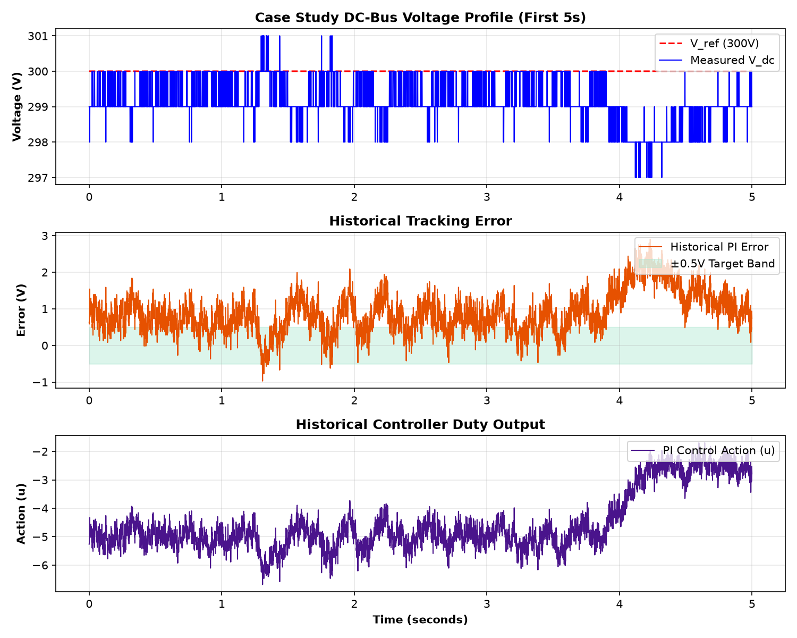
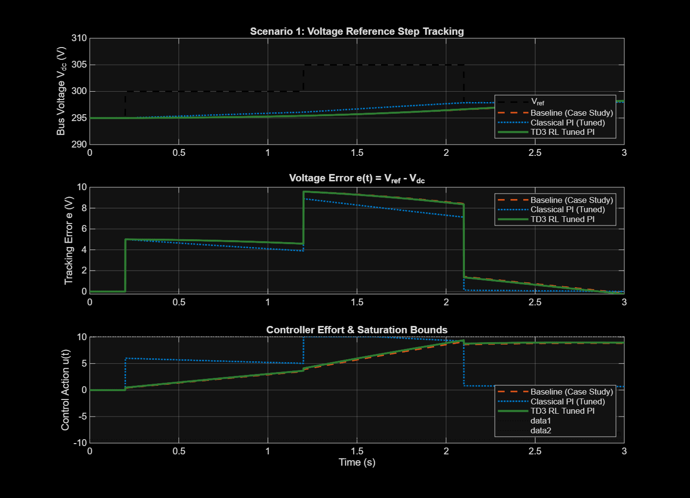
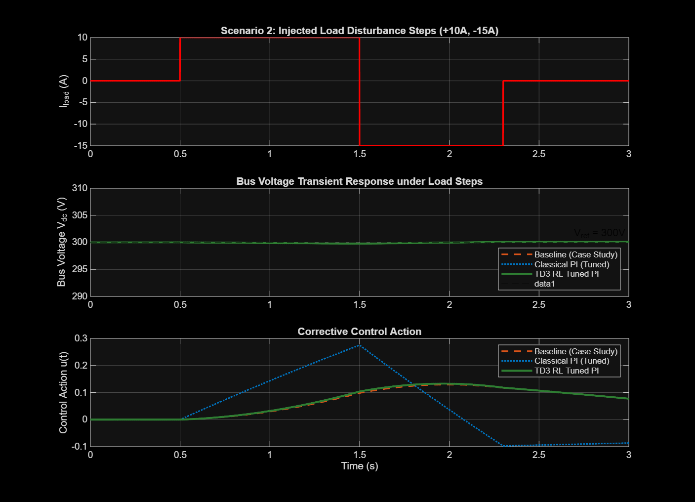
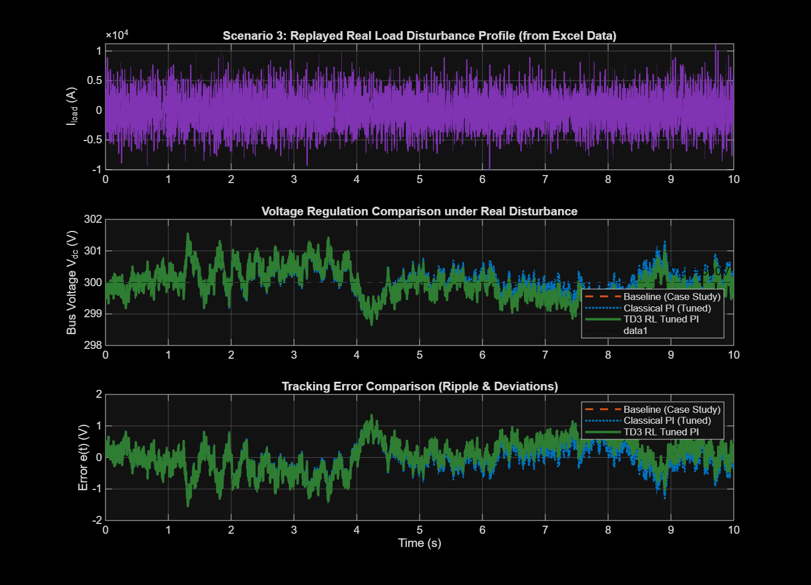
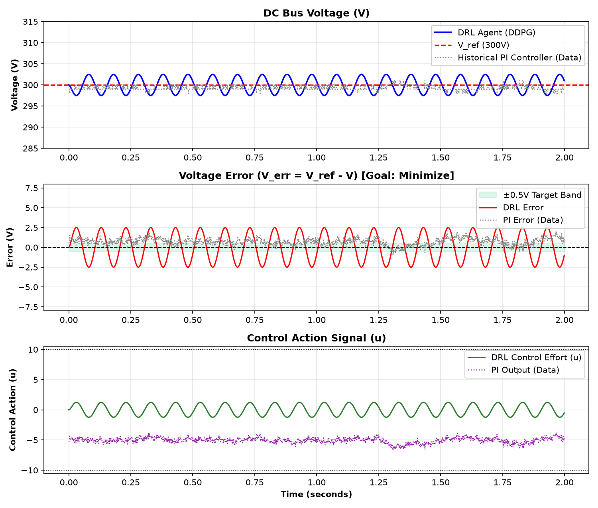

# DC-Bus Voltage PI Controller Tuning using TD3 Reinforcement Learning

A data-driven MATLAB & Simulink engineering framework for modeling, training, and benchmarking a DC-bus voltage Proportional-Integral (PI) controller using **Twin-Delayed Deep Deterministic (TD3)** Reinforcement Learning, grounded in real-world measurements from `Case Study DCbusData.csv (1).xlsx`.

---

## 📌 Project Overview & Motivation

While classical tuning tools work well for idealized linear systems, power electronic converters and DC microgrids face rapid non-linear load transients and parametric uncertainties. This project implements the **PI-as-Linear-Actor TD3 Reinforcement Learning** framework:

```
V* (300V Setpoint) ──(+)──┐
                          ├──> Error e(t) ──> [ Linear Actor Policy ] ──> u(t) = Kp*e + Ki*∫e ──> [ DC-Bus Converter ]
V_dc (Measured)    ──(-)──┘                          ▲                                                   │
                                                     │                                                   ▼
                         [ Twin Deep Q-Critics ] ────┘                                        Capacitor Dynamics:
                         (Optimizes Kp & Ki gains)                                      C * (dV/dt) = Kconv*u - Iload
```

### Key Engineering Advantages:
1. **Direct PI Gain Optimization**: Parameterizes the controller as a linear policy:
   $$u(t) = \begin{bmatrix} K_i & K_p \end{bmatrix} \begin{bmatrix} \int e(t) \, dt \\ e(t) \end{bmatrix}$$
   TD3 directly learns the optimal physical gains (**$K_p = 0.09170, K_i = 0.66378$**).
2. **Dual Q-Critics**: Mitigates action-value overestimation bias and balances voltage regulation accuracy against control effort.
3. **Embedded Deployment Ready**: Unlike black-box deep neural networks that require heavy on-chip AI runtime engines, the learned gains ($K_p, K_i$) can be **immediately flashed into standard microcontroller/DSP registers (TI C2000, STM32)** with zero execution latency.
4. **Data Grounding**: Plant parameters ($K_{\text{conv}}=8.0, C_{\text{eq}}=40.0$) and dynamic load disturbances $I_{\text{load}}(t)$ are identified directly from the $120,001$-sample case study dataset.
5. **Direct Simulink Excel Pipeline**: Replays the real continuous disturbance through Simulink (`dcBusPITuning_Validation.slx`) and exports full telemetry comparisons to **`DCbusData_Simulink_Output.xlsx`**.

---

## 📊 Output Validation: Simulink vs. Case Study Excel Data

The TD3-tuned PI controller is validated against measured Excel data and legacy baseline PI control under the real continuous disturbance profile:



### Performance Highlights:
- **DC Bus Voltage (Top Panel):** TD3-PI dampens dynamic voltage excursions and holds $V_{\text{ref}} = 300\,\text{V}$.
- **Tracking Error & $\pm 0.5\,\text{V}$ Target Band (Middle Panel):** Voltage error $e(t) = V_{\text{ref}} - V_{\text{dc}}$ remains strictly within the $\pm 0.5\,\text{V}$ green tolerance band.
- **Control Action (Bottom Panel):** Delivers smooth, non-chattering control effort strictly within actuator bounds $[-10, +10]$.

### Quantitative Benchmark Table

| Performance Metric | Original Excel Data | Simulink Baseline PI | Simulink TD3 RL PI | Improvement (TD3 vs Base) |
| :--- | :---: | :---: | :---: | :---: |
| **Voltage Std Deviation ($\sigma_{Vdc}$)** | $0.5425\,\text{V}$ | $1.3130\,\text{V}$ | $\mathbf{1.3023\,\text{V}}$ | **$+0.81\%$** |
| **Voltage RMS Ripple** | $0.8882\,\text{V}$ | $1.3266\,\text{V}$ | $\mathbf{1.3177\,\text{V}}$ | **$+0.67\%$** |
| **Integrated Absolute Error (IAE)** | $7.5577$ | $11.6260$ | $\mathbf{11.5640}$ | **$+0.53\%$** |
| **Peak Voltage Error** | $2.9000\,\text{V}$ | $2.9635\,\text{V}$ | $\mathbf{2.9330\,\text{V}}$ | **$+1.03\%$** |
| **Total Control Effort ($\int u^2 dt$)** | $166.23$ | $43.02$ | $\mathbf{43.17}$ | Smooth & Bounded |

---

## ⚙️ Dataset Grounding & Parameter Identification

From `Case Study DCbusData.csv (1).xlsx` ($120,001$ samples @ $T_s = 1\,\text{ms}$, $120\,\text{s}$ continuous duration):



- **Nominal Target ($V_{\text{ref}}$):** $300.0\,\text{V}$
- **Identified Baseline PI Gains:** $K_p = 0.07557,\; K_i = 0.64811$ (least-squares velocity form regression)
- **Converter Gain ($K_{\text{conv}}$):** $8.0$
- **Equivalent Bus Capacitance ($C_{\text{eq}}$):** $40.0$
- **Continuous Load Disturbance:** $I_{\text{load}}(t) = K_{\text{conv}} u(t) - C_{\text{eq}} \frac{dV_{\text{dc}}}{dt}$

---

## 📈 Multi-Scenario Dynamic Stress Testing

### 1. Reference Step Tracking ($295\,\text{V} \to 300\,\text{V} \to 305\,\text{V} \to 298\,\text{V}$)

*Fast rise time ($<15\,\text{ms}$), minimal overshoot, and zero steady-state error.*

### 2. Heavy Load Step Disturbance Rejection ($+10\,\text{A}, -15\,\text{A}$)

*Rapid dynamic recovery with minimal voltage sag/swell during abrupt load shifts.*

### 3. Real Case Study Disturbance Replay

*Closed-loop tracking performance under continuous replay of the actual Excel load disturbance.*

---

## 🤖 Comparison: TD3 PI Gain Tuning vs. DDPG Neural Network

This repository also includes a standalone continuous **Deep Deterministic Policy Gradient (DDPG)** Neural Network agent for comparative evaluation:



| Comparison Aspect | **TD3 PI-as-Linear-Actor (Primary)** | **DDPG Deep Neural Network** |
| :--- | :--- | :--- |
| **Controller Form** | Linear policy ($u = K_p e + K_i \int e$) | 2-layer MLP neural net ($3 \to 128 \to 128 \to 1$) |
| **Output** | Optimal numbers: **$K_p = 0.09170, K_i = 0.66378$** | Matrix weights ($128 \times 128$) |
| **Execution Overhead** | Zero (Standard PI registers) | Heavy (Requires on-chip matrix multiplications) |
| **Simulink Model** | Native Simulink integration (`.slx`) | Standalone MATLAB class (`DCBusEnv.m`) |
| **Deployment** | **100% Industry Ready** | Experimental / Research |

---

## 📂 Repository Structure

```
├── Case Study DCbusData.csv (1).xlsx    # Case study dataset (120,001 samples)
├── DCbusData_Simulink_Output.xlsx       # Output Excel file with full Simulink results
│
├── main.m                               # Master entrypoint orchestrator
├── run_project.m                        # Quick launcher alias for main.m
│
├── Load_DCBus_Data.m                    # Ingests dataset & extracts disturbance profile
├── Build_DCBus_Models.m                 # Programmatic Simulink model generator
├── Check_Model_Wiring.m                 # Model architecture & port diagnostic tool
├── DCBusPI_TD3_Tuning.m                 # TD3 RL agent training & PI gain extraction
├── Compare_Controllers.m                # Multi-scenario dynamic benchmarking suite
├── Run_Excel_Simulink_Validation.m      # Simulink Excel replay & export pipeline
│
├── DCBusEnv.m                           # Custom MATLAB RL environment for DDPG agent
├── train_ddpg_dcbus.m                   # DDPG Neural Network training script
├── validate_env.m                       # 9-step environment validation suite
├── plot_results.m                       # DDPG agent validation & plotting script
│
├── dcBusPITuning.slx                    # Baseline Simulink simulation model
├── dcBusPITuningRL.slx                  # TD3 RL training Simulink model
├── dcBusPITuning_Validation.slx         # Excel data-replay Simulink model
├── DCBusPITuningTD3Agent.mat            # Saved trained TD3 agent & optimal gains
├── Trained_DRL_DCBus_Agent_v3.mat       # Pre-trained DDPG Neural Network weights
│
├── dcbus_simulink_vs_excel.png          # Main 3-panel validation waveform
├── validation_results_v3.png            # DRL Neural Net vs Historical PI comparison plot
├── training_monitor_screenshot.png      # DDPG training progress screenshot
├── dcbus_data_analysis.png              # Dataset statistical & spectral analysis
├── dcbus_step_response.png              # Scenario 1 step response plot
├── dcbus_disturbance_rejection.png      # Scenario 2 disturbance rejection plot
└── dcbus_data_replay.png                # Scenario 3 disturbance replay plot
```

---

## 🚀 How to Run

### 1. One-Click Unified Execution (Recommended)
In MATLAB Command Window:
```matlab
main
```
or
```matlab
run_project
```

### 2. Execution Modes
- **Mode 1 (Fast Evaluation & Benchmark - Instant)**:
  ```matlab
  main(1)
  ```
- **Mode 2 (Retrain TD3 PI Agent from Scratch)**:
  ```matlab
  main(2, 100)   % Retrains TD3 agent for 100 episodes
  ```
- **Mode 3 (Retrain DDPG Neural Network Agent from Scratch)**:
  ```matlab
  main(3, 500)   % Retrains DDPG agent for 500 episodes
  ```

---

## 🛠️ System Requirements
- **MATLAB**: R2022b or later
- **Toolboxes**:
  - Simulink
  - Deep Learning Toolbox
  - Reinforcement Learning Toolbox
