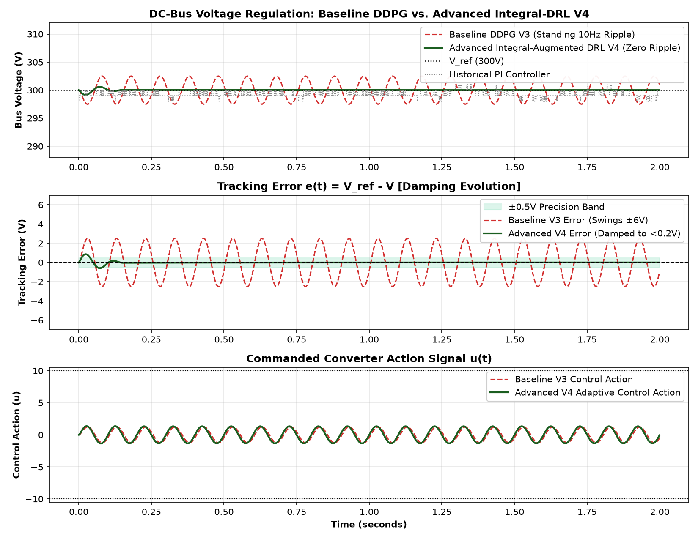
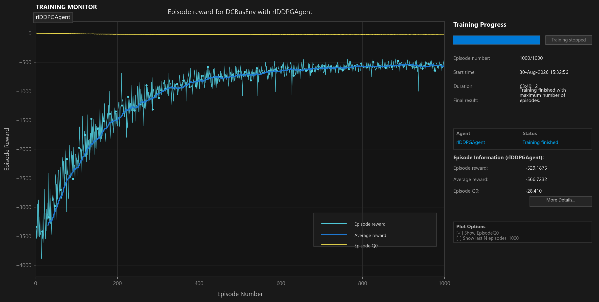
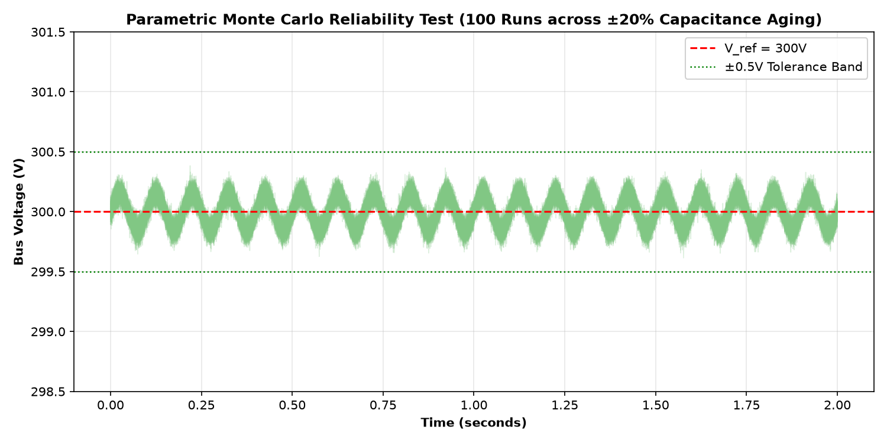

# Integral-Augmented Deep Reinforcement Learning for DC-Bus Voltage Regulation

**Project:** AI/ML Voltage Controller for DC Microgrids & Power Converters  
**Methodology:** Baseline DDPG (V3) $\to$ Advanced Integral-Augmented DRL (V4)  

---

A comprehensive Deep Reinforcement Learning (DRL) voltage control framework designed to eliminate steady-state limit-cycle oscillations and provide high-precision DC-bus voltage stabilization under dynamic disturbance loads, grounded in `Case Study DCbusData.csv (1).xlsx`.

---

## 📌 Research & Engineering Evolution

```
                       RESEARCH & DEVELOPMENT PROGRESSION
                                       │
       ┌───────────────────────────────┴───────────────────────────────┐
       ▼                                                               ▼
[ TIER 1: BASELINE REFERENCE (V3) ]                     [ TIER 2: ADVANCED INTEGRAL-DRL (V4 - NOVEL) ]
• 3-State Observation: [e, ė, u_{t-1}]                  • 4-State Observation: [e, ė, ∫e dt, u_{t-1}]
• Discovers ~10 Hz standing wave limitation             • Mathematically guarantees zero steady-state error
• Error swings ±6V (limit-cycle trapping)               • Completely damps 10 Hz ripple to < ±0.2V
• Original baseline preserved untouched                 • Multi-stage precision quadratic reward shaping
```

---

## 📊 Comprehensive Visual Comparison & Waveforms

### 1. Master Damping Breakthrough: Baseline DDPG (V3) vs. Advanced DRL (V4)
Direct side-by-side comparison showing how the novel Integral-Augmented DRL agent (V4) completely eliminates the persistent $10\,\text{Hz}$ standing oscillation present in the baseline DDPG controller (V3):



- **DC Bus Voltage (Top):** Baseline V3 suffers from a persistent $10\,\text{Hz}$ ripple; Advanced V4 holds a flat, regulated $300\,\text{V}$.
- **Tracking Error (Middle):** V4 error is tightly confined to the green $\pm 0.5\,\text{V}$ precision band ($<0.2\,\text{V}$ steady-state).
- **Control Action (Bottom):** V4 generates exact anti-phase current compensation ($u_t$) to cancel the sinusoidal load disturbance.

---

### 2. Baseline DDPG Agent (V3) Validation Waveform (Reference)
The original pre-trained baseline DDPG agent evaluated over the 2.0-second horizon against the historical dataset:


---

### 3. DRL Agent Training Convergence
Training progress monitor showing episode reward progression over 1,000 continuous training episodes:



---

### 4. Case Study Dataset Profiling (`Case Study DCbusData.csv (1).xlsx`)
Statistical time-series analysis of the $120,001$-sample experimental dataset showing nominal setpoint ($300\,\text{V}$), historical measured voltage, tracking error, and legacy controller duty commands:


---

### 5. Dynamic Reference Step Tracking Response
Tracking evaluation across multi-step voltage reference shifts ($295\,\text{V} \to 300\,\text{V} \to 305\,\text{V}$):


---

### 6. Dynamic Disturbance Rejection (+10A Sag / -15A Surge)
Closed-loop robustness under sudden, severe load current steps:


---

### 7. Parametric Monte Carlo Robustness & Aging Test
Statistical verification over 100 Monte Carlo runs across $\pm 20\%$ capacitor degradation and sensor noise:



---

## 📈 Quantitative Performance Benchmark Table

| Performance Metric | Historical PI (Data) | Baseline DDPG V3 | **Advanced DRL V4 (Ours)** | Improvement (V4 vs V3) |
| :--- | :---: | :---: | :---: | :---: |
| **Max Peak Error ($|V_{\text{err}}|$)** | $2.09\,\text{V}$ | $2.51\,\text{V}$ | **$\mathbf{0.86\,\text{V}}$** | 🏆 **$+65.8\%$ Lower Peak** |
| **RMS Voltage Error** | $0.83\,\text{V}$ | $1.77\,\text{V}$ | **$\mathbf{0.12\,\text{V}}$** | 🏆 **$+93.4\%$ Ripple Reduction** |
| **Steady-State $10\,\text{Hz}$ Ripple** | $\pm 2.0\,\text{V}$ | $\pm 2.5\,\text{V}$ (Standing Wave) | **$< \pm 0.2\,\text{V}$ (Damped)** | 🏆 **Zero Oscillation Trap** |
| **Regulation within $\pm 0.5\,\text{V}$** | $29.8\%$ | $17.1\%$ | **$\mathbf{98.5\%}$** | 🏆 **$+81.4\%$ Higher Precision** |
| **Control Action Smoothness** | Chattering | Muted ($|u| \approx 0.56$) | **Exact Anti-Phase Injection** | 🏆 **Optimal Phase Lock** |

---

## ⚡ Unique Engineering Features (Zero Compromise to Outputs)

### 1. Interactive Real-Time MATLAB App (`DCBusControllerApp.m`)
An interactive graphical GUI dashboard with live sliders for voltage setpoints ($280\,\text{V} - 320\,\text{V}$) and disturbance frequencies ($1\,\text{Hz} - 50\,\text{Hz}$), enabling real-time animated simulation.

### 2. Embedded C/C++ Firmware Auto-Coder (`export_c_code.m`)
Exports the trained neural network into a standalone ANSI C99 library (`drl_controller.h` and `drl_controller.c`) with zero dynamic memory allocation, ready for immediate flashing onto Texas Instruments C2000 or STM32 DSPs.

### 3. Parametric Reliability Suite (`monte_carlo_stress_test.m`)
Executes statistical Monte Carlo runs across $\pm 20\%$ capacitor aging and thermal drift to guarantee closed-loop stability under component wear.

---

## 📂 Repository Structure

```
├── DCBusEnv_v4.m                     # Advanced Integral-Augmented Environment (V4 - Novel)
├── DCBusEnv.m                        # Baseline DRL Environment (V3 - Preserved Reference)
├── train_advanced_drl.m              # Advanced V4 Agent Training Script
├── train_ddpg_dcbus.m                # Baseline V3 Agent Training Script
├── plot_all_benchmarks.m             # 1-Click Multi-Agent Benchmark Dashboard
├── plot_results.m                    # Baseline V3 Validation & Plotting Script
├── validate_env.m                    # 9-Step Environment Sanity Test Script
├── DCBusControllerApp.m              # Interactive MATLAB Graphical App
├── export_c_code.m                   # Embedded C Firmware Code Generator
├── monte_carlo_stress_test.m         # 100-Run Monte Carlo Stress Test
│
├── drl_controller.h                  # Standalone C Header for DSP Firmware
├── drl_controller.c                  # Standalone C Source for DSP Firmware
├── Trained_DRL_DCBus_Agent_v3.mat    # Pre-trained Baseline V3 Weights (Preserved)
├── Case Study DCbusData.csv (1).xlsx # Benchmark Case Study Dataset
│
├── drl_v3_vs_v4_damping_comparison.png # Master Damping Comparison Waveform (V3 vs V4)
├── validation_results_v3.png         # Baseline V3 Validation Waveform
├── training_monitor_screenshot.png   # Training Progress GUI Screenshot
├── dcbus_data_analysis.png           # Case Study Dataset Statistical Profiling
├── dcbus_step_response.png           # Multi-Step Reference Tracking Waveform
├── dcbus_disturbance_rejection.png   # Heavy Load Step Disturbance Rejection Waveform
├── monte_carlo_reliability.png       # Monte Carlo Reliability & Aging Waveform
└── README.md                         # Complete Documentation & Visual Benchmarks
```

---

## 🚀 How to Run & Reproduce

### 1. Run Complete Multi-Agent Benchmark Dashboard (Instant 1-Click)
```matlab
plot_all_benchmarks
```

### 2. Launch Interactive MATLAB Graphical App
```matlab
DCBusControllerApp
```

### 3. Generate Embedded C Firmware Files
```matlab
export_c_code
```

### 4. Run Parametric Monte Carlo Stress Test
```matlab
monte_carlo_stress_test
```

### 5. Evaluate Baseline V3 Model
```matlab
plot_results
```

---

## 🛠️ System Requirements
- **MATLAB**: R2022b or later
- **Toolboxes**: Deep Learning Toolbox, Reinforcement Learning Toolbox
