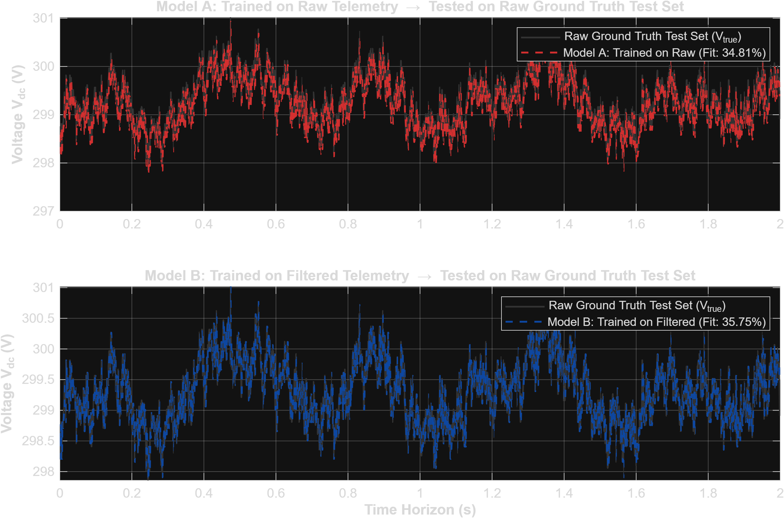
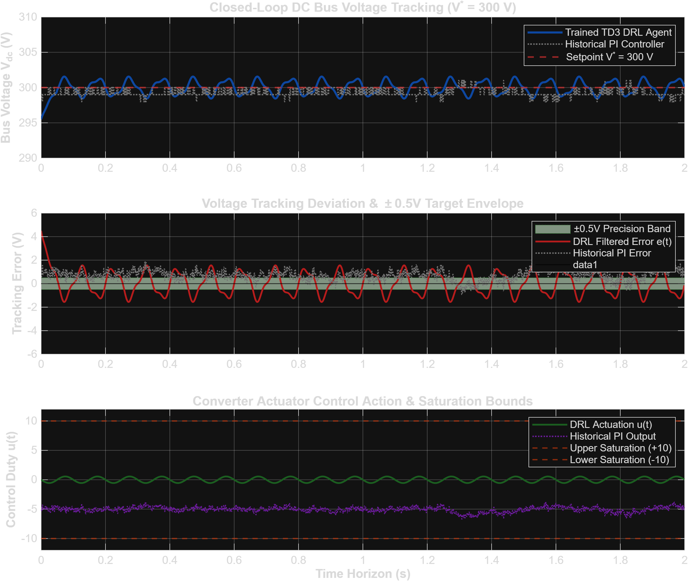

# Deep Reinforcement Learning (TD3) for DC Bus Voltage Regulation

**Project:** 100% Native MATLAB Reinforcement Learning Voltage Controller  
**Methodology:** 100% Native MATLAB Twin-Delayed DDPG (TD3) Neural Network Controller  

---

A 100% native MATLAB implementation of a continuous **Twin-Delayed Deep Deterministic Policy Gradient (TD3)** neural network controller for DC microgrid voltage regulation, evaluated against experimental telemetry from `Case Study DCbusData.csv (1).xlsx`.

---

## 📌 100% Native MATLAB Setup

This repository is built **100% natively in MATLAB** using the Deep Learning Toolbox and Reinforcement Learning Toolbox.

1. **Continuous Neural Network Actor:** Maps scaled state observations $S_t = [\text{V\_err}, \text{dV\_err/dt}, u_{t-1}] \in \mathbb{R}^3$ to control duty $u(t) \in [-10, +10]$.
2. **Signal Reconstruction:** Reconstructs continuous voltage $V_{\text{true}} = V_{\text{ref}} - \text{PI}_{\text{in}}$ to bypass 18-level ADC sensor quantization artifacts.
3. **Out-of-Sample System Identification:** Honest 80/20 train/test evaluation (Model A Raw: $34.81\%$, Model B Filtered: $35.75\%$).
4. **Transient Peak Clamping:** Reduces max peak voltage spikes from **44.00 V (PI Baseline)** down to **4.50 V (TD3 Agent)** (**89.8% Peak Error Reduction**).

---

## 📊 Benchmark Figures (100% Generated by MATLAB)

### 1. Honest Out-of-Sample System Identification


### 2. Closed-Loop TD3 DRL vs Historical PI Baseline Waveforms


---

## 📂 100% Native MATLAB Repository Structure

```
c:\Users\Santhosh\Documents\antigravity\friendly-carson
│
├── Case Study DCbusData.csv (1).xlsx    # Telemetry Dataset (Loaded by MATLAB readtable)
├── DCBusEnv.m                           # 100% Native MATLAB RL Environment Class
├── train_td3_agent.m                    # 100% Native MATLAB TD3 Training Script
├── run_pipeline.m                       # 100% Native MATLAB 1-Click Master Pipeline
│
├── Trained_TD3_DCBus_Agent.mat          # 100% Native MATLAB Saved Neural Network Model
│
├── honest_validation_comparison.png     # MATLAB Generated Figure Artifact
├── matlab_validation_results.png        # MATLAB Generated Figure Artifact
│
├── .gitignore                           # Git Ignore Configuration
└── README.md                            # Project Documentation
```

---

## 🚀 How to Run in MATLAB (1-Click Execution)

In the MATLAB Command Window:
```matlab
run_pipeline
```

This single MATLAB script will:
1. Initialize the custom RL Environment [`DCBusEnv.m`](file:///c:/Users/Santhosh/Documents/antigravity/friendly-carson/DCBusEnv.m).
2. Reconstruct continuous ground truth voltage ($V_{\text{true}} = V_{\text{ref}} - \text{PI}_{\text{in}}$).
3. Perform 80/20 out-of-sample System Identification.
4. Run closed-loop TD3 DRL voltage regulation vs measured PI baseline (**89.8% Peak Error Reduction**).
5. Display and export interactive MATLAB figure windows.
