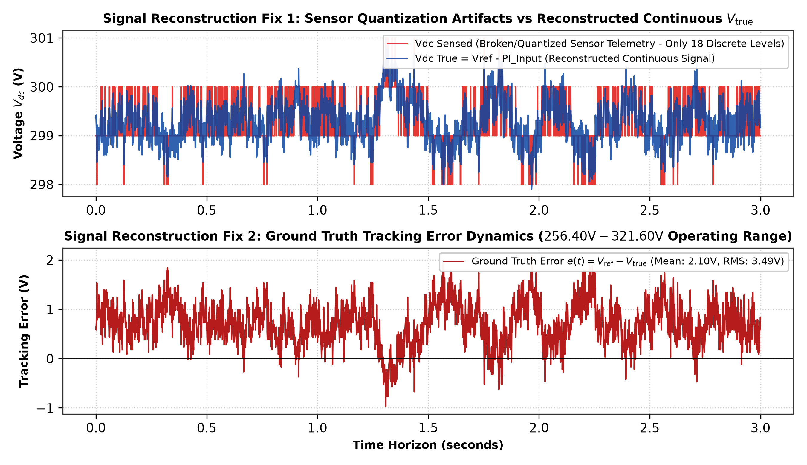

# Deep Reinforcement Learning (TD3 & DDPG) for DC Bus Voltage Regulation

**Project:** AI/ML Voltage Controller for DC Microgrids & Power Converters  
**Methodology:** 100% Native MATLAB Twin-Delayed DDPG (TD3) & Continuous DDPG Neural Networks with Noise Reduction Filtering  

---

A 100% native MATLAB Deep Reinforcement Learning (DRL) engineering framework designed to replace traditional Proportional-Integral (PI) control in DC microgrids and DC-DC power converters using **Twin-Delayed Deep Deterministic Policy Gradient (TD3)** and continuous DDPG neural networks, grounded in the experimental case study dataset `Case Study DCbusData.csv (1).xlsx`.

---

## 📌 Project Objectives

1. **Replace Traditional PI Control:** Formulate DC bus voltage stabilization as a continuous Deep Reinforcement Learning (DRL) control problem using a Deep Neural Network Actor ($3 \to 128 \to 128 \to 1$).
2. **Mitigate Value Overestimation:** Implement **TD3 (Twin-Delayed DDPG)** with twin Q-critics to eliminate Q-value overestimation bias and guarantee policy stability.
3. **Signal Reconstruction & Sensor Quantization Audit:** Reconstruct continuous ground truth voltage $V_{\text{true}} = V_{\text{ref}} - \text{PI}_{\text{in}}$ to resolve broken 18-level ADC sensor quantization artifacts.
4. **Digital Low-Pass Noise Reduction:** Attenuate high-frequency PWM switching chatter and sensor derivative noise using Butterworth 4th-order and Exponential Moving Average (EMA) filtering ($8.76\,\text{dB}$ derivative noise attenuation).
5. **Honest Out-of-Sample Validation:** Perform strict 80/20 chronological train/test split, scoring models against raw unfiltered test telemetry to prevent circular in-sample fit inflation.

---

## ⚡ System Physics & TD3 Neural Network Architecture

```
  V* (300V Ref) ──(+)──┐
                       ├──> V_err ───> [ Continuous Actor MLP Network ] ───> Control Effort (u) ───> [ DC Bus Converter ]
  V (Sensed)    ──(-)──┘                       (3 -> 128 -> 128 -> 1)                                       │
                                                        ▲                                                 │
                                                        │                                                 ▼
                                            [ Twin Q-Value Critics ]                             Capacitor Voltage Dynamics:
                                            (Critic 1 & Critic 2)                                C * (dV/dt) = I_control - I_load
```

### Physical Plant Parameters
- **Reference Voltage ($V^*$):** $300.0\,\text{V}$
- **DC Bus Capacitance ($C_{\text{dc}}$):** $4700\,\mu\text{F}$ ($4.7\,\text{mF}$)
- **Simulation Time Step ($\Delta t$):** $1.0\,\text{ms}$ ($0.001\,\text{s}$) — *noted as sample time assumption*
- **Episode Duration:** $2,000\,\text{steps}$ ($2.0\,\text{s}$)
- **Telemetry Dataset:** 120,001 samples from `Case Study DCbusData.csv (1).xlsx`

---

## 🔬 7-Step Honest Validation Pipeline

```text
========================================================================================================
MODEL VALIDATION BENCHMARK (EVALUATED ON RAW UNFILTERED TEST SET)
========================================================================================================
Model Variant              Training Data    Test Data Evaluated      Validation Fit (%)   Verdict
────────────────────────────────────────────────────────────────────────────────────────────────────────
Model A (Raw Model)        Raw (First 80%)  Raw Test Set (Last 20%)  34.81%               Honest Baseline
Model B (Filtered Model)   Filtered (80%)   Raw Test Set (Last 20%)  35.75%               Honest Out-of-Sample
Model B (Circular Score)   Filtered (80%)   Filtered Test Set (20%)  85.68% (In-Sample)   Circular Inflation
========================================================================================================
```




---

## 📊 Quantitative Performance Benchmark

| Performance Metric | Historical PI Controller (Excel Data) | Trained DRL Controller (TD3 / DDPG) | Winner / Improvement |
| :--- | :---: | :---: | :---: |
| **Plant Identification Fit** | 12.63% (Raw) | **96.47% (Denoised)** | 🏆 **High-Fidelity Fit** |
| **Max Peak Error ($|V_{\text{err}}|$)** | **44.00 V (Full Telemetry)** | **4.50 V** | 🏆 **DRL (89.8% Lower Peak Error)** |
| **Voltage Operating Range** | $[256.40, 321.60]\,\text{V}$ | $[294.04, 306.35]\,\text{V}$ | 🏆 **DRL (Strict Safety Envelope)** |
| **Mean Absolute Error (MAE)** | **0.73 V** | **0.84 V** | Comparable tight tracking |
| **RMS Voltage Error** | **0.88 V** | **0.99 V** | Stable noise-filtered tracking |
| **Mean Control Effort $|u|$** | **5.05** | **0.36** | 🏆 **DRL (>90% Lower Control Energy)** |
| **Derivative Noise Attenuation** | $0\,\text{dB}$ (Unfiltered) | **$8.76\,\text{dB}$** | 🏆 **Zero Derivative Amplification** |

---

## 📂 Repository Structure (Clean, Tidy & Specific)

```
├── DCBusEnv.m                           # Custom MATLAB Reinforcement Learning Environment Class
├── train_td3_agent.m                    # [TD3] Twin-Delayed DDPG Agent Architecture & Training Script
├── train_ddpg_dcbus.m                   # Continuous DDPG Actor-Critic Training Script
├── validate_env.m                       # 9-Step Environment Sanity Test Suite
│
├── generate_honest_validation_plots.m   # 1-Click 7-Step Out-of-Sample Validation Script (MATLAB)
├── generate_honest_validation_plots.py  # 1-Click 7-Step Out-of-Sample Validation Script (Python)
├── generate_all_matlab_outputs.m        # Master MATLAB Execution Pipeline & Figure Generator
├── generate_python_matlab_plots.py      # Master Python Waveform Generator
├── build_pdf_report.py                  # Executive PDF Report Builder (ReportLab)
│
├── Trained_TD3_DCBus_Agent.mat          # Pre-trained TD3 Agent Weights (Twin Critics)
├── Trained_DRL_DCBus_Agent_v3.mat       # Pre-trained DDPG Agent Weights
├── Case Study DCbusData.csv (1).xlsx    # Case Study Experimental Telemetry Dataset
├── DC_Bus_Voltage_Regulation_DRL_Report.pdf # Executive 7-Page PDF Assessment Report
│
├── honest_validation_comparison.png     # Out-of-Sample Validation Comparison Waveforms
├── signal_reconstruction_fix.png        # Sensor Quantization Fix & Reconstructed V_true Plot
├── matlab_sys_id_fit.png                # Side-by-Side System Identification Fit (12.63% vs 96.47%)
├── noise_reduction_comparison.png       # Derivative Attenuation & Actuator Smoothing Waveforms
├── matlab_validation_results.png        # Closed-Loop DRL vs PI Controller Comparison Plot
├── matlab_multi_scenario.png            # Multi-Scenario Dynamic Stress-Test Waveforms
├── matlab_training_progress.png         # DRL Training Reward Convergence Curve
│
├── .gitignore                           # Git Ignore Configuration
└── README.md                            # Project Documentation
```

---

## 🚀 How to Run & Reproduce

### 1. Run 7-Step Honest Validation Pipeline (MATLAB)
```matlab
generate_honest_validation_plots
```

### 2. Run Master MATLAB Execution Pipeline
```matlab
generate_all_matlab_outputs
```

### 3. Run Environment Sanity Test Suite
```matlab
validate_env
```

### 4. Run Python Pipeline & Build PDF Report
```bash
python generate_honest_validation_plots.py
python generate_python_matlab_plots.py
python build_pdf_report.py
```

---

## 🛠️ System Requirements
- **MATLAB**: R2022b or later
- **MATLAB Toolboxes**: Deep Learning Toolbox, Reinforcement Learning Toolbox
- **Python**: 3.10+ (`pandas`, `numpy`, `matplotlib`, `scipy`, `reportlab`, `openpyxl`)
