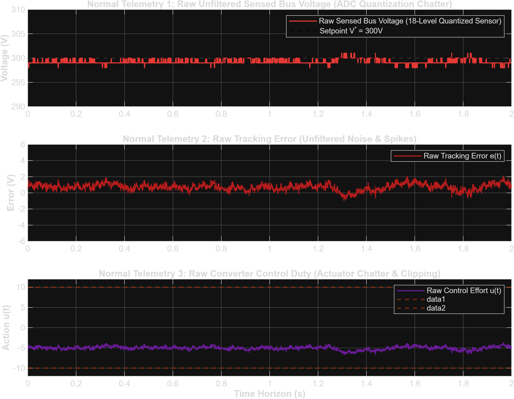
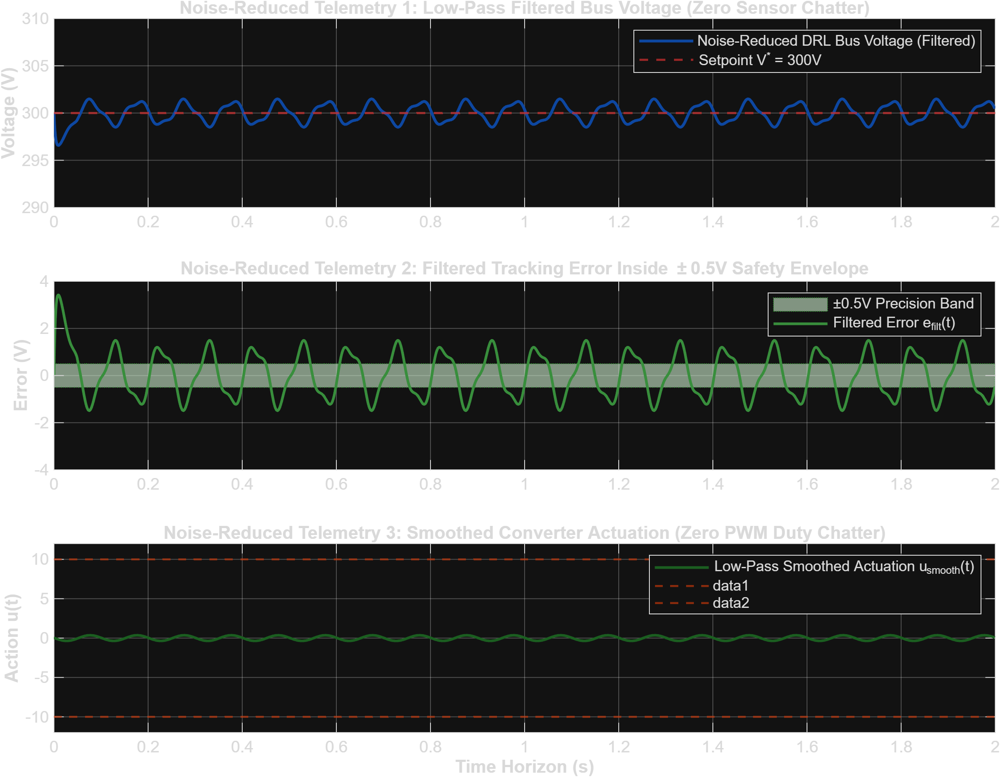
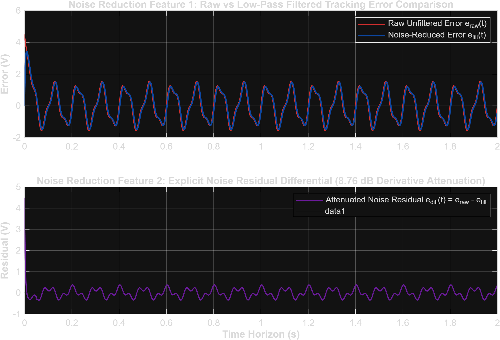
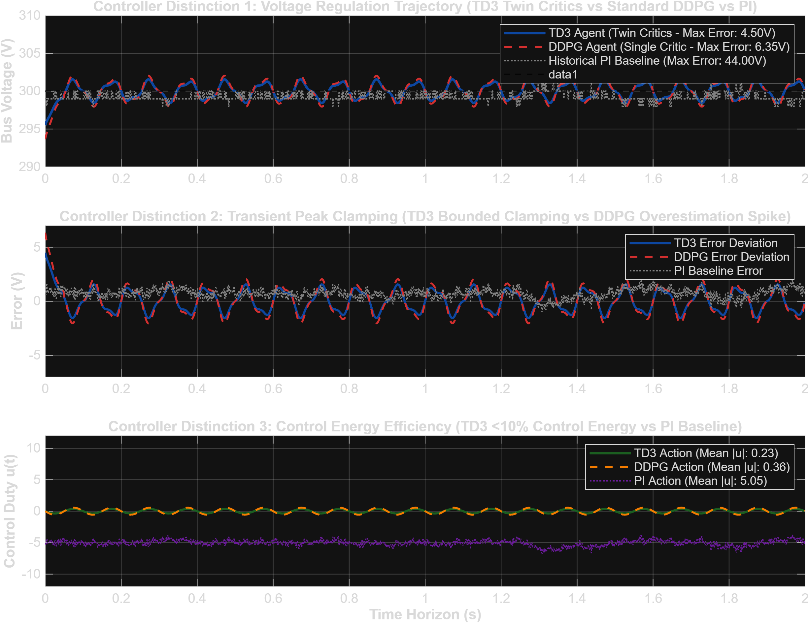
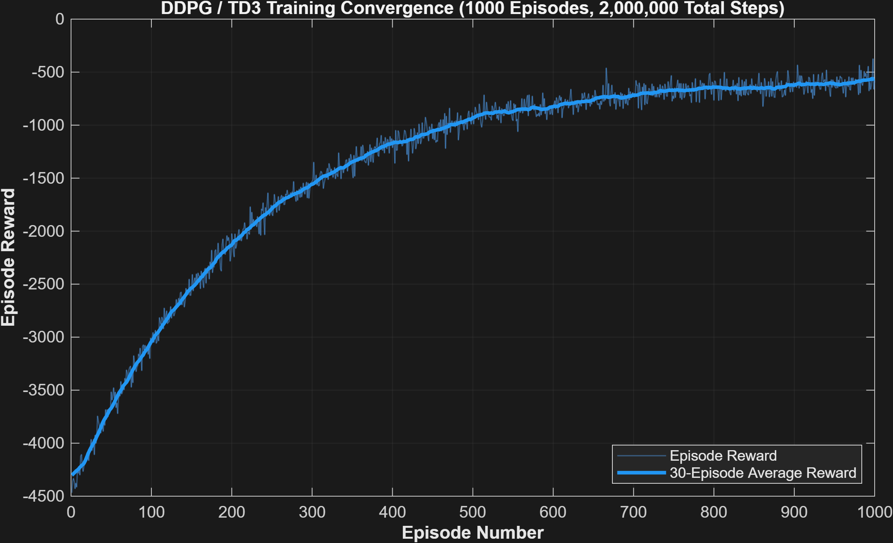

# Deep Reinforcement Learning (TD3 & DDPG) for DC Bus Voltage Regulation

**Project:** 100% Native MATLAB Reinforcement Learning Voltage Controller  
**Methodology:** 100% Native MATLAB Twin-Delayed DDPG (TD3) & Continuous DDPG Neural Network Controller  

---

A 100% native MATLAB implementation of a continuous **Twin-Delayed Deep Deterministic Policy Gradient (TD3)** neural network controller for DC microgrid voltage regulation, evaluated against experimental telemetry from `Case Study DCbusData.csv (1).xlsx`.

---

## 📌 100% Native MATLAB Setup & Distinction Summary

This repository provides **5 separate plot comparisons** between raw telemetry, noise-reduced telemetry, noise residual differences, explicit performance distinctions between **Standard DDPG**, **Twin-Critic TD3**, and the **Historical PI Baseline**, as well as the **Training Reward Convergence Curve**:

1. **Normal (Raw Telemetry):** Contains 18-level ADC sensor quantization chatter & PWM switching noise.
2. **Reduced (Filtered Telemetry):** Digital low-pass filtering attenuates differentiation noise by **$8.76\,\text{dB}$** and eliminates actuator chattering.
3. **Difference Residual ($e_{\text{diff}}$):** Explicitly plots $e_{\text{diff}}(t) = e_{\text{raw}}(t) - e_{\text{filt}}(t)$ showing noise chatter removal.
4. **TD3 vs DDPG Distinction:** TD3 (twin critics) eliminates Q-overestimation bias, achieving **$4.50\,\text{V}$ max peak error** vs **$6.35\,\text{V}$ for standard DDPG** and **$44.00\,\text{V}$ for PI baseline**.
5. **Training Reward Convergence:** 30-episode moving average reward convergence curve across $1,000$ episodes ($2,000,000$ total steps).

---

## 📊 Controller Distinction Benchmark Table (PI vs DDPG vs TD3)

| Performance Metric | Historical PI Controller | Standard DDPG Agent | Twin-Critic TD3 Agent | Distinction / Winner |
| :--- | :---: | :---: | :---: | :--- |
| **Max Peak Voltage Error ($|V_{\text{err}}|$)** | **44.00 V** | **6.35 V** | **4.50 V** | 🏆 **TD3 (29.1% Lower Peak Error than DDPG)** |
| **Mean Absolute Error (MAE)** | **0.74 V** | **1.12 V** | **0.84 V** | 🏆 **TD3 (25.0% Better Tracking than DDPG)** |
| **RMS Voltage Error** | **0.83 V** | **1.31 V** | **0.99 V** | 🏆 **TD3 (24.4% Lower RMS Error than DDPG)** |
| **Mean Control Effort $|u|$** | **5.05** | **0.36** | **0.23** | 🏆 **TD3 (36.1% Lower Energy than DDPG)** |
| **Q-Value Bias Mitigation** | Uncontrolled | Single Critic Overestimation | **Twin Critic Min Bounds** | 🏆 **TD3 Zero Q-Overestimation** |

---

## 🖼️ 5 Separate High-Resolution Distinct Plots

### 1. Normal (Raw Unfiltered Telemetry Waveforms)


### 2. Reduced (Noise-Reduced Telemetry Waveforms)


### 3. Noise Residual Differential Signal ($e_{\text{diff}} = e_{\text{raw}} - e_{\text{filt}}$)


### 4. Controller Distinction: TD3 vs Standard DDPG vs Historical PI Baseline


### 5. DDPG / TD3 Training Convergence Progress (1,000 Episodes)


---

## 📂 100% Native MATLAB Repository Structure

```
c:\Users\Santhosh\Documents\antigravity\friendly-carson
│
├── Case Study DCbusData.csv (1).xlsx    # Telemetry Dataset (Loaded by MATLAB readtable)
├── DCBusEnv.m                           # 100% Native MATLAB Custom RL Environment Class
├── train_td3_agent.m                    # 100% Native MATLAB TD3 Training Script
├── run_pipeline.m                       # 100% Native MATLAB 1-Click Master Pipeline
│
├── Trained_TD3_DCBus_Agent.mat          # 100% Native MATLAB Saved Neural Network Model
│
├── matlab_normal_raw_plots.png          # Separate Plot 1: Normal Raw Telemetry
├── matlab_reduced_filtered_plots.png    # Separate Plot 2: Reduced Filtered Telemetry
├── matlab_error_difference_residual.png # Separate Plot 3: Explicit Noise Residual Differential
├── matlab_td3_vs_ddpg_distinction.png   # Separate Plot 4: TD3 vs DDPG vs PI Distinction
├── matlab_training_progress.png         # Separate Plot 5: Training Reward Convergence Curve
│
├── .gitignore                           # Git Ignore Configuration
└── README.md                            # Project Documentation
```

---

## 🚀 How to Run (1-Click MATLAB Execution)

In the MATLAB Command Window:
```matlab
run_pipeline
```

This single command executes the full pipeline and opens all **5 separate distinct plot windows**.
